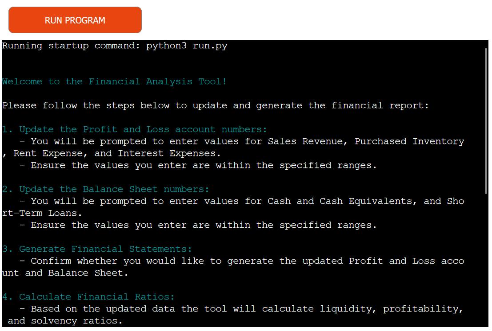
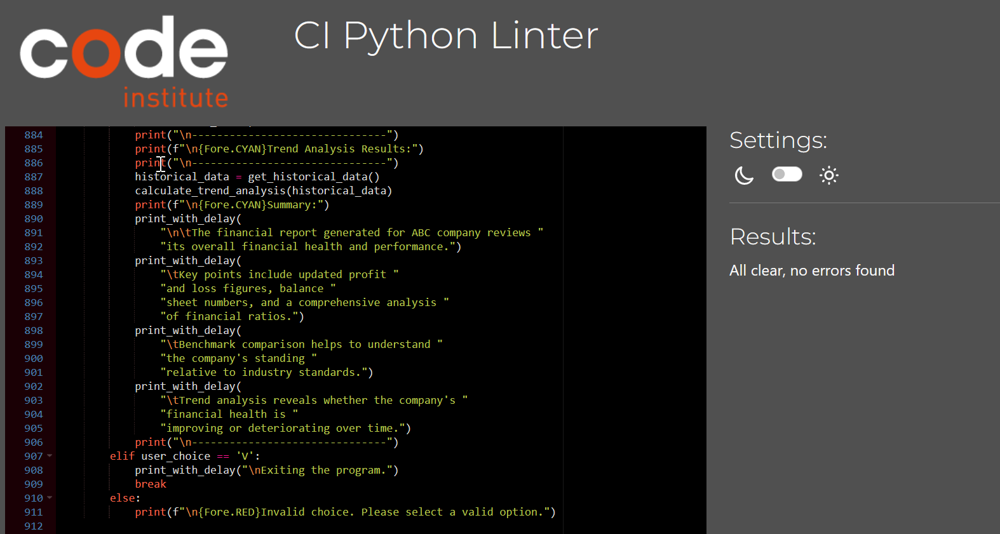

# Financial Statements Analysis Tool

Visit the deployed site: [Financial Statements Analysis Tool](https://fin-statements-analysis-tool-13d33c22c8d1.herokuapp.com/)

This tool updates and analyses the financial performance of a small company. It uses Google Sheets and Python to manage data extracted from financial statements, calculates financial ratios, and carries out benchmark and trend analyses.
## Table of Contents

- [Project Description](#project-description)
  - [User goals](#user-goals)
  - [Site owner goals](#site-owner-goals)
- [Pre-development](#pre-development)
- [Features](#features)
  - [Update Profit and Loss Account](#update-profit-and-loss-account)
  - [Update Balance Sheet](#update-balance-sheet)
  - [Generate Financial Statements](#generate-financial-statements)
  - [Calculate Financial Ratios](#calculate-financial-ratios)
  - [Update Ratios in Google Sheets](#update-ratios-in-google-sheets)
  - [Options for users to select next step](#options-for-users-to-select-next-step)
  - [Analyse and Compare Ratios](#analyse-and-compare-ratios)
  - [Benchmark Analysis](#benchmark-analysis)
  - [Trend Analysis](#trend-analysis)
  - [Summary](#summary)
  - [Future Implementations](#future-implementations)
- [Technologies Used](#technologies-used)
    - [Resources](#resources)
  - [Libraries](#libraries)
- [Testing](#testing)
  - [Features Testing](#features-testing)
  - [Input Validation Testing](#input-validation-testing)
  - [Other Testing](#other-testing)
  - [Testing Browsers](#testing-browsers)
- [Future Updates](#future-updates)
- [Validation](#validation)
- [Deployment](#deployment)
    - [Heroku](#heroku)
- [Solved Bugs](#solved-bugs)
- [Credits](#credits)

## Project Description

This tool updates and analyses the financial performance of a small company. It manages financial data, calculates various financial ratios, and carries out benchmark and trend analyses. The data is stored in Google Sheets and Python is used to update and analyse it.

The main goals of this project are to:

- Reduce the time spent updating financial statements manually.
- Automate the calculation of financial ratios.
- Provide a comprehensive financial report.
- Compare financial performance against industry benchmarks and historical data.

### User goals:

- Update financial statements quickly and accurately.
- Automatically calculate and analyse financial ratios.
- Compare current financial performance with historical data and industry benchmarks.

### Site owner goals

- Provide an easy-to-use tool for financial analysis.
- Ensure data accuracy and reliability.

## Features

### Update Profit and Loss Account

The user is prompted to update the following accounts: sales revenue, inventory, rent, and interest expenses. A specific number range is provided for users. 

### Update Balance Sheet

A user is prompted to update the following accounts: cash and cash equivalents and short-term loans. The specific number range is provided for users. 
Once the data is entered, the profit and loss and balance sheet tabs are updated in Google Sheets.

### Generate Financial Statements

A user is given a choice whether they want to generate updated financial statements or not. 

### Calculate Financial Ratios

The following ratios are calculated automatically:

 - Liquidity ratios: current and quick ratios
 - Profitability ratios: net profit margin and return on assets
 - Solvency ratios: debt-to-equity ratio and interest cover

### Update Ratios in Google Sheets

Once all ratios are calculated, the results are being updated in Google Sheets. Namely, the results are added to the fourth quarter the Ratios Historical Data tab. These Quarter 4 data is after used to carry out various types of analysis as part of the financial reporting.

### Options for users to select next step

After updating the financial data, users can choose what they want to see next. The tool offers the following options:
- financial ratios analysis
- benchmark comparison -
- trend analysis
- run a complete financial report that combines all options above. 

This flexibility allows users to tailor the analysis to their specific needs and interests.

### Analyse and Compare Ratios

The tool provides a detailed analysis of financial ratios, including liquidity, profitability, and solvency ratios. This analysis helps users understand the financial health of the company, highlighting areas of strength and potential concern

### Benchmark Analysis

The tool compares the calculated financial ratios with industry benchmarks. This comparison helps users understand how their company is performing relative to industry standards, identifying areas where the company excels or may need improvement.

### Trend Analysis

The trend analysis feature evaluates financial ratios over four quarters to identify patterns and changes over time. This analysis helps users understand the direction of the company's financial performance, spotting trends that may indicate future challenges or opportunities.

### Summary

The summary provides a short explanation of what is included in the financial report and why these features are important.

#### Future Implementations

1. Add a more detailed ratio analysis.
2. Implement visualisation options for financial data.
3. Enable exporting of the report to PDF and Excel formats.

## Technologies Used

- Python
- [Google Sheets API](https://developers.google.com/sheets/api) - To interact with Google Sheets.

### Resources

- Codeanywhere
- Gitpod
- GitHub
- Heroku

### Libraries

- [colorama](https://pypi.org/project/colorama/) - To highlight important sections of the generated report
- [gspread](https://github.com/burnash/gspread) - A Python library to interact with Google Sheets.
- [time](https://docs.python.org/3/library/time.html) -To apply an incremental time effect to the output.
- [Google OAuth2](https://google-auth.readthedocs.io/en/latest/) - For authentication.

## Testing

Once the tool was operational, testing was carried out to identify and fix any errors.

The following tests were run to ensure the tool is working correctly:

### Features Testing

| **Feature**   | **Action**                    | **Expected Result**          | **Actual Result** |
| ------------- | ----------------------------- | ---------------------------- | ----------------- |
| Instructions | User is given detailed instructions | Instructions are presented on the screen | Works as expected |
| Profit and Loss input | User is prompted to enter numbers for particular accounts within the defined range| Prompt is presented to the user, the users adds a number | Works as expected |
| Balance Sheet input | User is prompted to enter numbers for particular accounts within the defined range| Prompt is presented to the user, the users adds a number | Works as expected |
| Update Profit and Loss Account in Google Sheets | Results are automatically added to the profit_and_loss tab| Results are added to the Google Sheets | Works as expected |
| Update Balance Sheet in Google Sheets | Results are automatically added to the balance_sheet tab| Results are added to the Google Sheets | Works as expected |
| Option to generate Financial Statements | User chooses "y" to generate financial statements | Statements are displayed correctly | Works as expected |
| Option to generate Financial Statements | User chooses "n" to generate financial statements | Statements are not displayed, program runs the next task | Works as expected |
| Calculate Liquidity Ratios | Current and Quick ratios are calculated automatically | Ratios are calculated correctly| Works as expected |
| Calculate Profitability Ratios | Net Profit Margin and Return on Assets ratios are calculated automatically | Ratios are calculated correctly| Works as expected |
| Calculate Solvency Ratios | Debt-to-Equity and Interest Cover ratios are calculated automatically | Ratios are calculated correctly| Works as expected |
| Update ratios in Google sheets| Results are automatically added to the ratios_historical_data tab | Results are added to the Google Sheets | Works as expected|
| Options what to do next | User is given 5 options to select what to do next  | Choices are presented to the user | Works as expected |
| Option I. Financial ratios analysis  | User chooses to run ratios analysis   | Financial ratios are analysed and displayed with commentary | Works as expected |
| Option II. Benchmark comparison | User chooses to run benchmark analysis   | Benchmarks are extracted from  industry_benchmarks tab, compared to actual results and displayed along with the comments| Works as expected |
| Option III. Trend analysis | User chooses to run trend analysis   | Historical data is extracted from  ratios_historical_data tab, results of four quartesquarters are compared to eahc other and displayed along with the comments| Works as expected |
| Option IV. Complete financial report (all points from I to III) | User chooses to run all three options presented above | Financial ratios, benchmark, trend analysis are displayd followed by a short summary | Works as expected |
| Option V. Exit | User chooses to exit the program  | Program stops showing a message "Exiting the program" | Works as expected |
| Program runs until user chooses to exit | User decides when to finish the program | User is asked to make a choice until option V. is selected  | Works as expected |

### Input Validation Testing

| **Feature**   | **Action**                    | **Expected Result**          | **Actual Result** |
| ------------- | ----------------------------- | ---------------------------- | ----------------- |
| Financial Statements input validation | User enters a non-numeric character | "Input must contain only digits" message is displayed | Works as expected |
| Financial Statements input validation | User enters a number outside the specified range | User is prompted to re-enter the number within the specified range | Works as expected |
| Financial Statements input validation | User enters a number with decimal places | User is prompted to re-enter the number within the specified range and without decimal places | Works as expected |
| Financial Statements input validation | User enters a number with leading zero/zeros | "Leading zeros are not allowed" message is displayed | Works as expected |
| Financial Statements input validation | User types "exit" | "Exiting the program" message is displayed, the program stops working | Works as expected |
| Options what to do next | If user types anything but the options presented, they will be prompted to select a valid option| "Invalid choice. Please select a valid option" message is displayed | Works as expected |
| Options to generate financial statements | If user types anything but the options presented, they will be prompted to select a valid option | "Invalid choice. Please select 'y' for yes or 'n' for no." message is displayed | Works as expected |

### Other Testing

| **Feature**   | **Action**                    | **Expected Result**          | **Actual Result** |
| ------------- | ----------------------------- | ---------------------------- | ----------------- |
| Generate financial statements | Formulas are applied in both Google Sheets and Python program to calculate totals for both statements | Both the program and Google sheets show the same results for the financial statements | Works as expected |
| Calculate financial ratios | If the denominator of the ratio is zero value error is raised | "Name of the ratio - should not be zero" message is displayed| Works as expected |
| Calculate financial ratios | Negative ratios are grouped and presented with a warning | "Warning: the following ratios are negative, immediate investigation is required" message is displayed followed by the list of ratios | Works as expected |
| Trend Analysis | Significant positive/negative results are brought to the user's attention| "Significant positive/negative trends" warning message is displayed, followed by the list of these trends | Works as expected |

### Testing Browsers

The tool has been tested in the following browsers:

- Chrome
- Edge
- Firefox

It worked without issues in the above browsers.

## Validation

PEP8 - Python style guide checker was used. All code was validated, and adjustments were made where necessary.

## Deployment

### Heroku

The Application has been deployed from GitHub to Heroku by following these steps:

1. Create or log in to your account at heroku.com.
2. Create a new app, add a unique app name (e.g., financial-statements-analyser) and choose your region.
3. Click on create app.
4. Go to "Settings".
5. Under Config Vars, add the private API key information using key 'CRED' and the value from the .json file. Also, add a key 'PORT' and value '8000'.
6. Add required buildpacks. For this project, set Python on top and Node.js on the bottom.
7. Go to "Deploy" and select "GitHub" in "Deployment method".
8. Enter your repository name, click 'Search' and then 'Connect'.
9. Choose the branch to build your app from.
10. Optionally, enable "Automatic Deploys" to keep the app up to date.
11. Wait for the app to build. Once ready, you will see the “App was successfully deployed” message and a 'View' button to access your deployed link.

## Solved Bugs

- Apply validation errors when inputting data, no bugs identified
- Corrected calculation formulas for financial ratios.
- Adjust the code formatting in order to deploy on Heroku